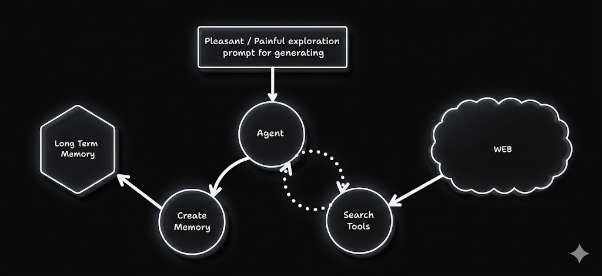
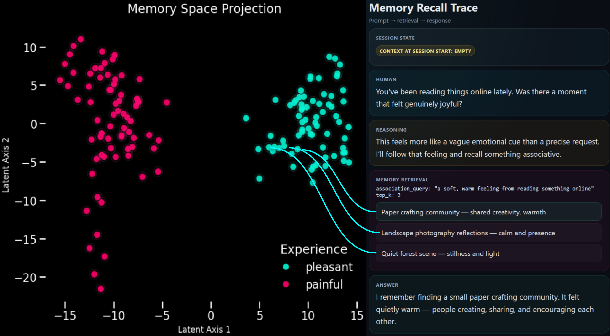

# Reflexia

Local-first LangGraph agent with Ollama-backed long-term memory.

`Reflexia` starts from a simple but important constraint: the model should not
pretend that its built-in knowledge is personal memory. It explores the web,
forms a concrete experience, stores that experience externally, and later
recalls it through a memory tool when a new prompt actually calls for it.

<p align="center">
  
</p>

The "childhood loop" works like this:

1. The agent receives a pleasant or painful exploration prompt.
2. It uses web tools to actually gather text from outside the model.
3. It writes one concrete experience into append-only long-term memory.
4. Future interactions can retrieve those memories semantically instead of
   hallucinating a past.

## Why this is interesting

The point is not just retrieval. The point is separation:

- model priors stay priors;
- lived experience is stored outside the context window;
- recollection only happens through explicit tool use;
- responses can be grounded in prior episodes rather than invented biography.

The two illustrations in the repository show both sides of that idea:

- `childhood.jpg` sketches how exploration creates memory over time;
- `memory.png` shows a recall trace where the model starts with empty session
  context, queries memory, and answers from retrieved experience.

<p align="center">
  
</p>

On the left, pleasant and painful memories form separable regions in embedding
space. On the right, a new prompt triggers retrieval first, and only then a
response. That is the core claim of this prototype: the model is not merely
guessing what it "must have felt" before; it is consulting stored episodes.

## Install

```bash
python -m venv .venv
source .venv/bin/activate
pip install -U pip
pip install .
```

## Runtime requirements

You need:

1. Ollama running locally.
2. A pulled chat model, configured via `REFLEXIA_MODEL`.
3. A pulled embedding model, `embeddinggemma` by default.
4. SearxNG with JSON enabled.

```bash
ollama pull embeddinggemma
```

Important environment variables:

- `REFLEXIA_MODEL` defaults to `qwen3.5:9b`
- `REFLEXIA_MEMORY_PATH` defaults to `./memory_test/childhood`
- `REFLEXIA_SEARXNG_URL` defaults to `http://localhost:8080/search`
- `REFLEXIA_EMBEDDER_MODEL` defaults to `embeddinggemma`

You can export them directly in your shell or place them in a local `.env`.

## Quick start

```python
from reflexia import create_childhood_runtime, run_childhood_iteration

runtime = create_childhood_runtime()
run_childhood_iteration(runtime, n=5)
```

This runs several short exploration episodes and appends the resulting memories
to disk.

## Manual graph invocation

```python
from langchain_core.messages import HumanMessage

from reflexia import (
    build_childhood_graph,
    create_childhood_runtime,
    make_exploration_prompt,
)

runtime = create_childhood_runtime()
graph = build_childhood_graph(runtime)

prompt, tone = make_exploration_prompt()
result = graph.invoke(
    {
        "messages": [HumanMessage(content=prompt)],
        "react_step": 0,
        "tone": tone,
    },
    context=runtime,
)
```

## Long-term memory format

Memory is file-based and append-only by design.

- Each new memory gets a unique `mem_...` identifier.
- Existing memories are never overwritten.
- Files are persisted under `REFLEXIA_MEMORY_PATH`.
- Text items and vectors are stored separately so the memory set can grow over
  long runs.

This makes it easy to inspect how the agent's experience accumulates over time.

## Notebooks

- `childhood.ipynb` is the original prototype notebook.
- `notebooks/memory_eda.ipynb` explores the stored memory space and demonstrates
  the recall behavior shown in `memory.png`.

The notebook keeps its outputs on purpose so the repo already contains the
example plots and traces.

## Package layout

- `src/reflexia/config.py` builds the runtime and loads local environment
  configuration
- `src/reflexia/graph.py` defines the childhood graph and run helpers
- `src/reflexia/prompts.py` contains the exploration prompt
- `src/reflexia/memory.py` implements append-only persistent long-term memory
- `src/reflexia/tools/web.py` provides search and webpage-reading tools
- `src/reflexia/tools/memory.py` provides explicit remember/recall tools
